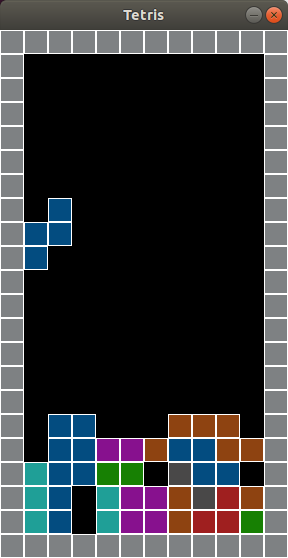

# python-tetris
Simple, unfinished, Tetris clone written in Python using SDL2.
# Running
Clone the repo then run `python3 main.py`.
If you don't have `PySDL2` installed run `pip3 install -U pysdl2`.
It needs Python >= 3.7 and right now only works on Unix because of 
`time.clock_gettime_ns()`.
# Screenshot

