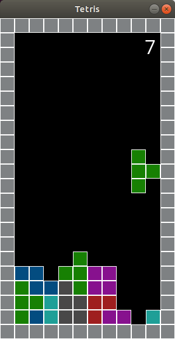

# python-tetris
Simple, unfinished, Tetris clone with simple AI, written in Python using SDL2. 
This is not optimized. For an optimized version check out 
[c-tetris](https://github.com/cmovz/c-tetris).

You can watch it live on your web browser if it supports WebAssembly, just go to: https://cmovz.io/webassembly-tetris-clone then click "Play Game" and then click "Toggle AI".
# Running
Clone the repo then run `python3 main.py` or `python3 main.py --ai`.

If you don't have `PySDL2` installed, run `pip3 install -r requirements.txt`.
It needs Python >= 3.7.
# Screenshot

